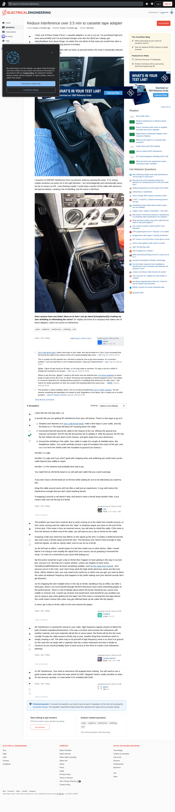

# Visited: https://electronics.stackexchange.com/questions/252978/reduce-interference-over-3-5-mm-to-cassette-tape-adapter
**Time:** Thu May  7 11:47:49 UTC 2026

## Screenshot

## Raw HTML
[page.html](./page.html)

## Downloaded Media (2 files)
## Downloaded Media Files

## Other Links
- [#](#)
- [#content](#content)
- [/](/)
- [/a/252984](/a/252984)
- [/a/252989](/a/252989)
- [/a/252991](/a/252991)
- [/a/252994](/a/252994)
- [/contact](/contact)
- [/feeds/question/252978](/feeds/question/252978)
- [/help](/help)
- [/help/privileges/protect-questions](/help/privileges/protect-questions)
- [/opensearch.xml](/opensearch.xml)
- [/posts/252978/ivc/97d9?prg=56181f9a-d63a-49a6-b99d-016ea3f199b3](/posts/252978/ivc/97d9?prg=56181f9a-d63a-49a6-b99d-016ea3f199b3)
- [/posts/252978/revisions](/posts/252978/revisions)
- [/posts/252978/timeline](/posts/252978/timeline)
- [/posts/252984/timeline](/posts/252984/timeline)
- [/posts/252989/timeline](/posts/252989/timeline)
- [/posts/252991/timeline](/posts/252991/timeline)
- [/posts/252994/timeline](/posts/252994/timeline)
- [/px.js?ch=1](/px.js?ch=1)
- [/px.js?ch=2](/px.js?ch=2)
- [/q/252978](/q/252978)
- [/questions](/questions)
- [/questions/129021/reduce-interference-in-wireless-mesh-network](/questions/129021/reduce-interference-in-wireless-mesh-network)
- [/questions/2346/non-metal-cases](/questions/2346/non-metal-cases)
- [/questions/240374/how-to-minimize-hash-noise-in-amplifier-mounted-near-boost-regulator](/questions/240374/how-to-minimize-hash-noise-in-amplifier-mounted-near-boost-regulator)
- [/questions/252978/reduce-interference-over-3-5-mm-to-cassette-tape-adapter](/questions/252978/reduce-interference-over-3-5-mm-to-cassette-tape-adapter)
- [/questions/252978/reduce-interference-over-3-5-mm-to-cassette-tape-adapter?answertab=scoredesc#tab-top](/questions/252978/reduce-interference-over-3-5-mm-to-cassette-tape-adapter?answertab=scoredesc#tab-top)
- [/questions/304863/signal-noise-in-bluetooth-adapter-when-using-sla-battery](/questions/304863/signal-noise-in-bluetooth-adapter-when-using-sla-battery)
- [/questions/308073/what-set-the-speed-in-a-cassette-tape-recorder](/questions/308073/what-set-the-speed-in-a-cassette-tape-recorder)
- [/questions/320594/audio-noise-with-5532-opamp](/questions/320594/audio-noise-with-5532-opamp)
- [/questions/527163/how-to-reduce-rfid-interference](/questions/527163/how-to-reduce-rfid-interference)
- [/questions/565143/diy-electromagnetic-shielding-cnc-mill](/questions/565143/diy-electromagnetic-shielding-cnc-mill)
- [/questions/639652/what-should-be-the-signal-levels-when-recording-a-tape-cassette](/questions/639652/what-should-be-the-signal-levels-when-recording-a-tape-cassette)
- [/questions/ask](/questions/ask)
- [/questions/tagged/audio](/questions/tagged/audio)
- [/questions/tagged/cellphone](/questions/tagged/cellphone)
- [/questions/tagged/emf](/questions/tagged/emf)
- [/questions/tagged/interference](/questions/tagged/interference)
- [/questions/tagged/shielding](/questions/tagged/shielding)
- [/tags](/tags)
- [/tour](/tour)
- [/unanswered](/unanswered)
- [/users](/users)
- [/users/11606/ignacio-vazquez-abrams](/users/11606/ignacio-vazquez-abrams)
- [/users/121017/manly](/users/121017/manly)
- [/users/47070/jre](/users/47070/jre)
- [/users/64875/gbluez](/users/64875/gbluez)
- [/users/89099/puffafish](/users/89099/puffafish)
- [/users/91862/pipe](/users/91862/pipe)

## Stats
- Links: 169
- Media: 2
